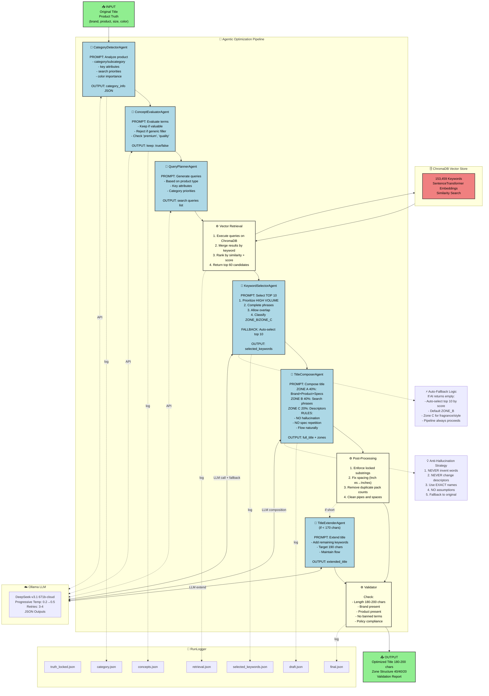

# AdKrux Multi-Agent Title Optimization Architecture

## Visual Architecture Diagram



---

## Architecture Components

### 🤖 AI Agents (6)

| Agent | Purpose | Input | Output |
|-------|---------|-------|--------|
| **CategoryDetectorAgent** | Classify product into category/subcategory | base_title, truth | category_info JSON |
| **ConceptEvaluatorAgent** | Filter subjective marketing terms | concept, type, context | keep: true/false |
| **QueryPlannerAgent** | Generate search queries for vector retrieval | title, truth, category | queries list |
| **KeywordSelectorAgent** | Select TOP 10 high-volume keywords | candidates, concepts, context | selected_keywords with zones |
| **TitleComposerAgent** | Compose optimized title with zone structure | all context + keywords | full_title with zone breakdown |
| **TitleExtenderAgent** | Extend short titles to 190 chars | short title, keywords | extended_title |

### ⚙️ Processing Steps (3)

| Process | Purpose | Operations |
|---------|---------|------------|
| **Vector Retrieval** | Query ChromaDB for relevant keywords | Execute queries → Merge results → Rank by score → Return top 60 |
| **Post-Processing** | Fix AI output artifacts | Enforce locked facts → Fix spacing → Remove duplicates |
| **Validator** | Final quality assurance | Check length, brand, product, banned terms |

### 🗄️ Data Storage

- **ChromaDB**: 153,459 keywords with SentenceTransformer embeddings
- **RunLogger**: 7 JSON files per run (truth, concepts, category, retrieval, keywords, draft, final)

### ☁️ LLM Configuration

- **Model**: DeepSeek-v3.1 (671b-cloud)
- **Temperature**: Progressive 0.2 → 0.3 → 0.4 → 0.5
- **Retries**: 3-4 attempts per agent call
- **Output**: JSON-structured responses

---

## Data Flow Sequence

```
1. INPUT (Original Title + Product Truth)
   ↓
2. CategoryDetectorAgent → Identify category/subcategory
   ↓
3. ConceptEvaluatorAgent → Filter subjective terms
   ↓
4. QueryPlannerAgent → Generate search queries
   ↓
5. Vector Retrieval → Query ChromaDB (60 candidates)
   ↓
6. KeywordSelectorAgent → Select TOP 10 (with auto-fallback)
   ↓
7. TitleComposerAgent → Compose with zones (40/40/20)
   ↓
8. Post-Processing → Fix spacing, enforce locks
   ↓
9. TitleExtenderAgent → Extend if < 170 chars (optional)
   ↓
10. Validator → Quality checks
   ↓
11. OUTPUT (Optimized Title 180-200 chars)
```

---

## Zone Structure (40/40/20)

### Zone A (40%) - Pure Information
- Brand name (once)
- Product type
- ALL specifications: size, dimension, count, color, material
- Locked facts used exactly once

**Example**: `Shalimar Garbage Bags, Medium 19 X 21 Inches, 120 Bags (30 Bags x 4 Rolls), Black`

### Zone B (40%) - Search Optimization
- High-volume search phrases from keywords
- Complete phrases (no truncation)
- NO repetition of Zone A specs
- Feature keywords customers search for

**Example**: `Garbage Bags Medium Size with Perforated Box for Easy Dispensing`

### Zone C (20%) - Descriptors
- Fragrance/flavor (exact names from original)
- Style/finish details
- Secondary attributes

**Example**: `Lavender Fragrance`

---

## Anti-Hallucination Strategy

### 5 Core Rules

1. **Source Constraint**: ONLY use words from original title OR approved keywords
2. **Exact Preservation**: NEVER change descriptors (Lavender ≠ Fresh, Steel ≠ Metal)
3. **Locked Facts**: Pack count and dimensions extracted via regex, enforced exactly once
4. **No Assumptions**: NEVER invent features not explicitly stated
5. **Fallback Safety**: Return original title if AI fails after retries

### Auto-Fallback Mechanisms

- **KeywordSelector**: If AI returns empty, auto-select top 10 by score
- **TitleComposer**: If AI fails, return original title
- **QueryPlanner**: If AI fails, use hardcoded queries
- **All Agents**: Progressive temperature increase on retry

---

## Execution Logs

Each run creates timestamped directory: `runs/YYYYMMDD_HHMMSS_title-slug/`

| File | Content |
|------|---------|
| `truth_locked.json` | Product attributes + extracted locked facts |
| `concepts.json` | Parsed concepts from original title |
| `category.json` | Category detection results |
| `retrieval.json` | Vector queries + top 60 candidates |
| `selected_keywords.json` | TOP 10 selected keywords with zones |
| `draft.json` | Title composition with zone breakdown |
| `final.json` | Optimized title + validation report |

---

## Key Metrics

- **Original Length**: Input title character count
- **Final Length**: Output title character count (target: 180-200)
- **Selected Keywords**: Number and list of TOP 10 keywords
- **Validation Status**: Pass/fail with issue list
- **Agents Used**: List of agents invoked (shows execution path)
- **Zone Distribution**: Character allocation across zones

---

## Example Transformation

### Input
```
Shalimar Premium (Lavender Fragrance) Scented Garbage Bags | Medium 19 X 21 Inches | 
120 Bags (30 Bags X 4 Rolls) | Dustbin Bag/Trash Bag | (Black) - Perforated Box for Easy Dispensing
```
(184 chars, pipes, redundant terms)

### Output
```
Shalimar Garbage Bags, Medium 19 X 21 Inches, 120 Bags (30 Bags x 4 Rolls), Black, 
Garbage Bags Medium Size with Perforated Box for Easy Dispensing, Lavender Fragrance
```
(180 chars, clean flow, high-volume phrase "garbage bags medium size" included, no hallucinations)

### Improvements
- ✅ Added high-volume phrase "garbage bags medium size" (0.4167 score)
- ✅ Removed pipes, clean comma separation
- ✅ No duplicate pack counts
- ✅ Exact fragrance name preserved
- ✅ Natural flow across zones
- ✅ No invented features

---

**Last Updated**: December 31, 2025  
**Version**: 1.0  
**Model**: DeepSeek-v3.1 (671b-cloud)
